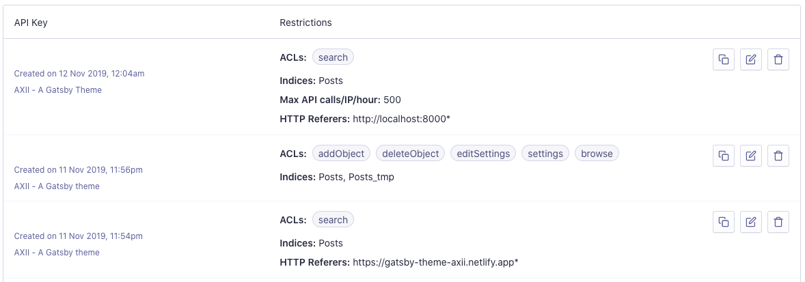

# AXII - A Gatsby blog theme

[](https://app.netlify.com/sites/gatsby-theme-axii/deploys)  

## Demo

- https://gatsby-theme-axii.netlify.app
- https://eshlox.net

## Features

- Markdown/MDX support
- Material UI
- Code syntax highlighter
- Responsive images
- Aloglia search with partial updates
- Light/Dark mode
- SEO
- RSS
- Sitemap
- Sentry support
- Twitter & Youtube embeds support

## Example site - source code

You can find the example site code in [packages/site](https://github.com/eshlox/gatsby-theme-axii/tree/master/packages/site) directory.

## How to use the theme

1. Create a new directory and add `package.json` file with this content:

```json
{
  "private": true,
  "name": "blog",
  "version": "0.0.1",
  "license": "MIT",
  "scripts": {
    "build": "gatsby build",
    "develop": "gatsby develop",
    "clean": "gatsby clean"
  }
}
```

2. Installation

```
npm install gatsby @eshlox/gatsby-theme-axii
```

3. Create an Algolia application and configure three API keys.

- admin API key for indexing
- search API key
- search API key for dev environment



4. Create `.env` file to provide Algolia credentials.

```env
ALGOLIA_APPLICATION_ID=APP-ID
ALGOLIA_ADMIN_API_KEY=ADMIN-API-KEY
ALGOLIA_SEARCH_API_KEY=SEARCH-API-KEY
ALGOLIA_INDEX_NAME=Posts
```

5. Configuration.

Create a `gatsby-config.js` file, use the configuration below and modify it to your needs.

```js
// Loads environment variables from a .env file into process.env
require("dotenv").config();

const options = {
  // The directory with blog posts (markdown/mdx files)
  contentPosts: "content/posts",
  // The site configuration
  siteMetadata: {
    // The site URL
    siteUrl: `https://gatsby-theme-axii.netlify.app`,
    // The index page title
    siteTitle: `Homepage`,
    // The site description
    siteDescription: `Very simple blog theme.`,
    // Author data
    author: {
      nickname: `eshlox`,
      // Author name. It's added to each page title.
      name: `Foo Bar`,
      firstName: "AXII",
      lastName: "A Gatsby theme",
      email: `email@example.com`,
      site: `gatsby-theme-axii.netlify.app`,
      gender: "male",
    },
    // Social accounts. Remove to disable.
    social: {
      twitter: {
        handle: "@eshlox",
        url: "https://twitter.com/eshlox",
      },
      github: {
        url: "https://github.com/eshlox/gatsby-theme-axii",
      },
      linkedin: {
        url: "https://linkedin.com/eshlox",
      },
      telegram: {
        url: "https://telegram.me/eshlox",
      },
    },
    // Data used for the manifest page file
    manifest: {
      name: `AXII - A Gatsby blog theme`,
      short_name: `AXII`,
    },
    // Data used to display support component. Remove to disable.
    support: {
      buymeacoffee: {
        url: "https://www.buymeacoffee.com/eshlox",
      },
    },
    // Comments services. Remove to disable.
    comments: {
      disqus: {
        shortname: "axii-a-gatsby-theme",
      },
    },
    // Alogolia application ID and credentials
    search: {
      algolia: {
        posts: {
          applicationId: process.env.ALGOLIA_APPLICATION_ID,
          searchApiKey: process.env.ALGOLIA_SEARCH_API_KEY,
          adminApiKey: process.env.ALGOLIA_ADMIN_API_KEY,
          indexName: process.env.ALGOLIA_INDEX_NAME,
        },
      },
    },
    errorReporting: {
      sentry: {
        dsn: process.env.SENTRY_DSN_URL,
      },
    },
  },
};

const plugins = [
  {
    resolve: "@eshlox/gatsby-theme-axii",
    options,
  },
];

module.exports = {
  plugins,
};
```

6. Run the development server.

```sh
npm run develop
```

7. Build the site.

```sh
npm run build
```

### Index page

To build the index page, create an `index.mdx` file in `content/pages` directory. It supports MDX so you can import and use all components. Components from [src/components](https://github.com/eshlox/gatsby-theme-axii/tree/master/packages/gatsby-theme-axii/src/components) are available automatically. Example:

```mdx
import Typography from "@material-ui/core/Typography";
import { GatsbySeo } from "gatsby-plugin-next-seo";

<GatsbySeo title="Homepage" />

<Typography variant="h1" component="h1" align="center">
  Greetings!
</Typography>

# AXII


## A Gatsby blog theme.

---

Lorem ipsum dolor sit amet, consectetur adipiscing elit. Ut imperdiet venenatis risus ac malesuada. Sed accumsan tellus libero, porttitor aliquam neque consequat aliquet. Nulla massa libero, ultricies ut sapien ac, sollicitudin pretium felis. Quisque non tellus fringilla, tempus sapien nec, vulputate nulla. Vivamus eleifend fringilla felis, ac facilisis nunc congue in. Nullam ac aliquam neque. Nam egestas molestie venenatis. Vivamus vitae ipsum in sem dapibus sodales vitae nec arcu.
```

### Open Graph images

| File                    | Description               |
| ----------------------- | ------------------------- |
| `static/og-default.png` | Image for `/` and `/blog` |
| `static/og-article.png` | Image for all blog posts  |

### Site favicon.

Add `icon.png` (favicon) file to the `content/images` directory.

### Blog posts

By default, blog posts should be stored in the `content/posts` directory. Example structure:

```
content
└── posts
    └── 2019
        ├── music-from-aladdin-2019
        │   └── index.mdx
        ├── photos-from-unsplash
        │   ├── images
        │   │   ├── carly-johnston-ndsA009eNy8-unsplash.jpg
        │   │   ├── eberhard-grossgasteiger-iYyfRNIgckk-unsplash.jpg
        │   │   ├── jamie-fenn-kj7Gp4LIvtw-unsplash.jpg
        │   │   └── todd-trapani-kLKg4fJlmqM-unsplash.jpg
        │   └── index.mdx
        └── twitter-test
            └── index.mdx
```

Example post file:

```md
---
title: Post title
date: 2019-11-05
categories: ["category"]
tags: ["tag1", "tag2"]
language: en
slug: post-title
comments: false
---

Post body.
```

| Key          | Required | Default Value            | Description                 |
| ------------ | -------- | ------------------------ | --------------------------- |
| `title`      | `True`   |                          | Post title                  |
| `date`       | `True`   |                          | Post creation date          |
| `categories` | `False`  |                          | List of the post categories |
| `tags`       | `False`  |                          | List of the post tags       |
| `language`   | `False`  | `en`                     | Post language               |
| `slug`       | `False`  | Autogenerated from title | Post slug (used in URL)     |
| `comments`   | `False`  | `True`                   | Enable/disable comments     |
